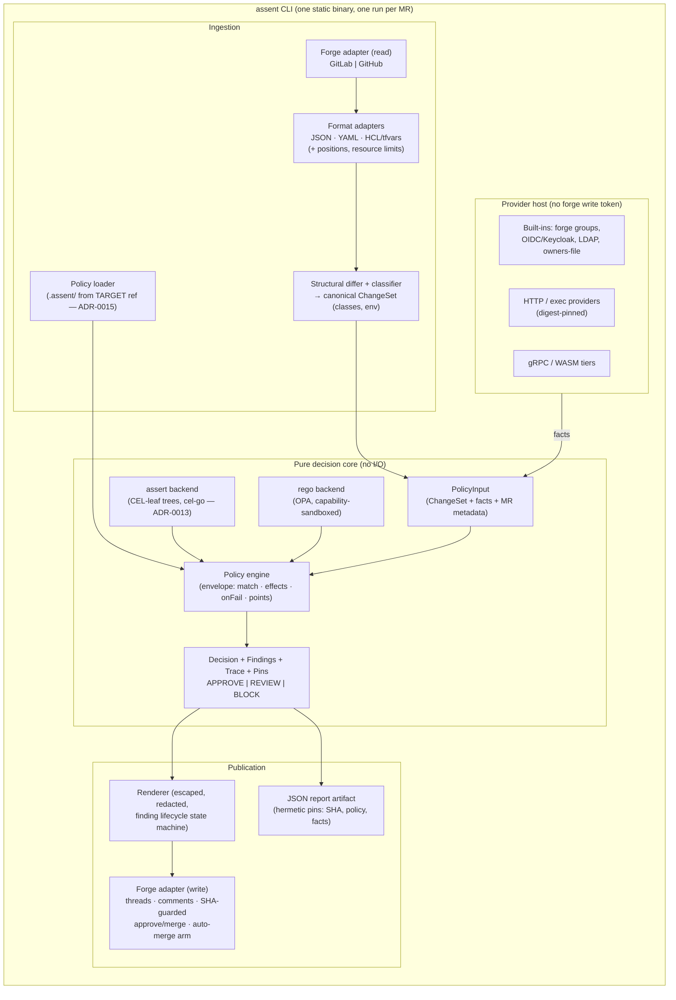

# C4 — Level 2: Containers / components

Hexagonal: a pure decision core, ports for everything with a side effect.



## Contracts (public, versioned)

| Contract | Consumers |
| --- | --- |
| **PolicyInput** schema (incl. predicate scope) | policy authors, test harness |
| **Decision/Findings/Pins** schema | forge adapters, audit tooling, `stats`, test harness |
| **Provider** request/response (content-keyed FactQuery) | plugin authors (HTTP, exec, gRPC, WASM) |
| **Forge port** semantics (SHA-guarded writes, thread lifecycle) | adapter implementers; defined by the conformance suite |
| **Test fixture format** (ADR-0014) | adopters |

## Package sketch (subject to spec phase)

```
cmd/assent/          CLI entrypoints: run, test, lint, explain, scan, stats, doctor, init
internal/core/       engine, decision model, aggregation                  (pure)
internal/change/     value tree, differ, classifier, ChangeSet            (pure)
internal/format/     json | yaml | hcl adapters (positions, limits)
internal/policy/     envelope loader (target-ref), assert backend, rego backend
internal/provider/   provider host + built-ins (token-isolated)
internal/forge/      port + gitlab | github adapters (SHA-guarded writes)
internal/render/     renderer, finding lifecycle, redaction
internal/harness/    adopter-facing policy test runner
```
