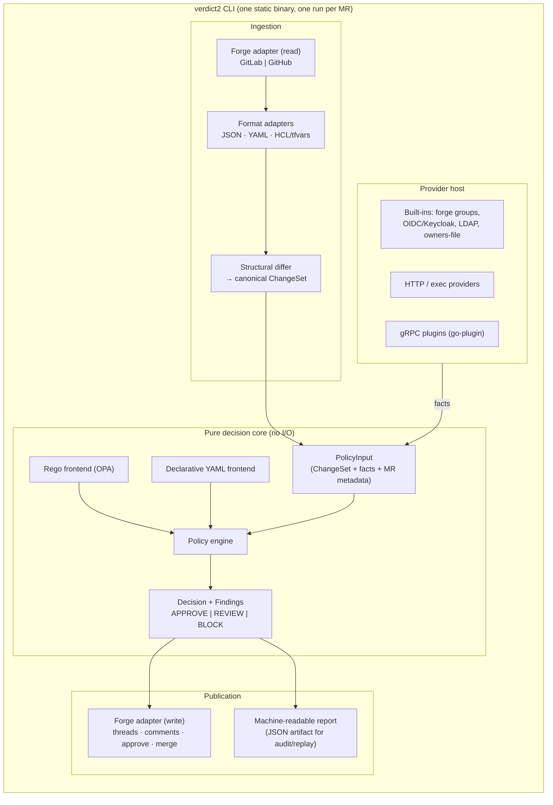

# C4 — Level 2: Containers / components

Hexagonal: a pure decision core, ports for everything with a side effect.



## Contracts (public, versioned)

| Contract | Consumers |
| --- | --- |
| **PolicyInput** schema | policy authors (Rego + YAML), test harness |
| **Decision/Findings** schema | forge adapters, audit tooling, test harness |
| **Provider** request/response | plugin authors (HTTP, exec, gRPC) |
| **Forge port** semantics | adapter implementers; defined by the conformance suite |

## Package sketch (subject to spec phase)

```
cmd/verdict2/          CLI entrypoints: run, test, lint, render
internal/core/         engine, decision model, policy loading   (pure)
internal/change/       value tree, differ, ChangeSet            (pure)
internal/format/       json | yaml | hcl adapters
internal/policy/       rego frontend, yaml frontend
internal/provider/     provider host + built-ins
internal/forge/        port + gitlab | github adapters
internal/harness/      user-facing policy test runner
```
