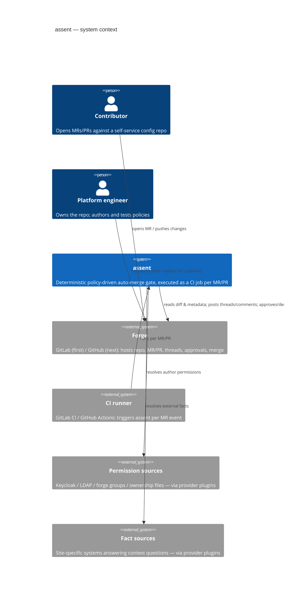

# C4 — Level 1: System context

Key property: assent is **stateless per invocation** — every run recomputes the decision
from (diff, repo snapshot, facts, policy version). No database, no long-lived service in v1.
